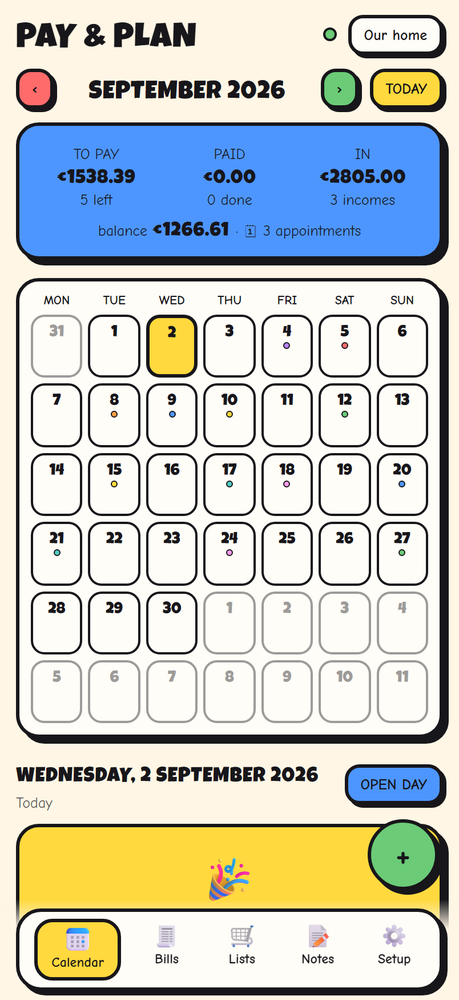
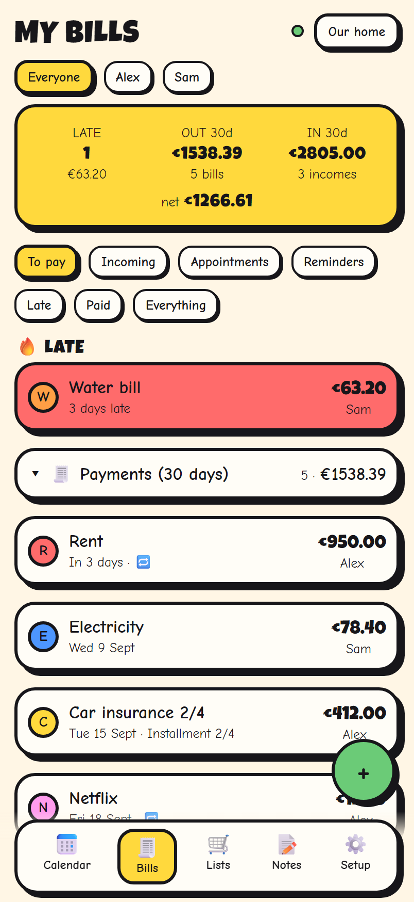
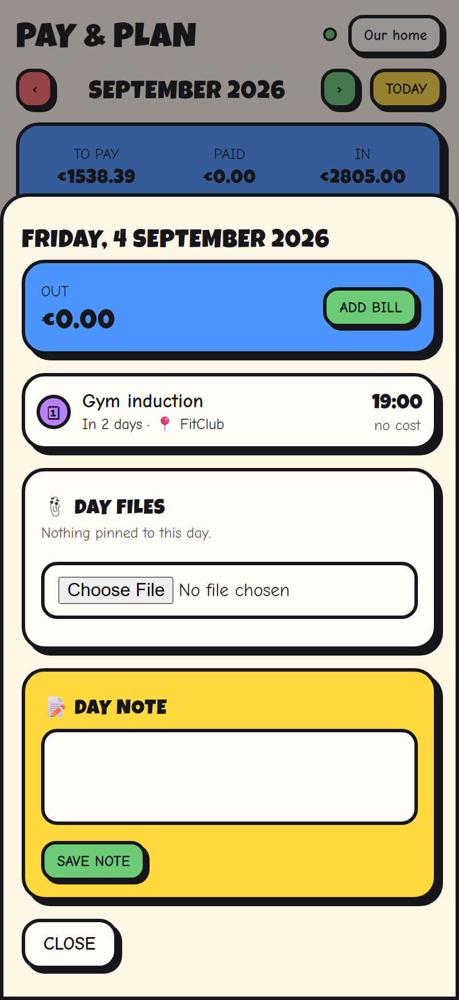
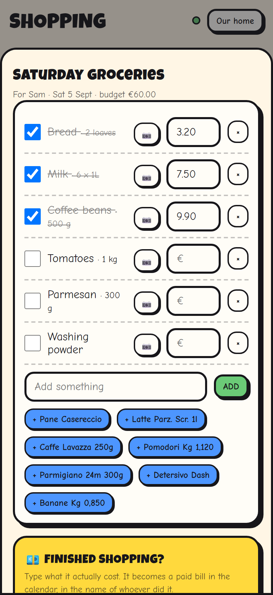
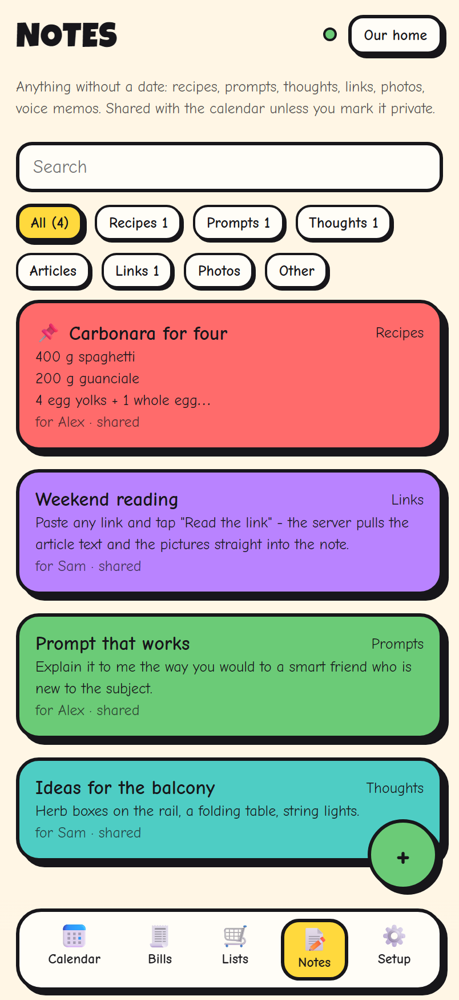
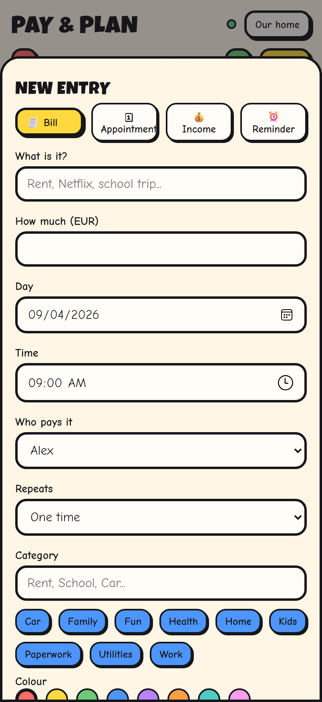

# Pay & Plan

**Bills, receipts, appointments and the shopping list — shared with the people you actually live with.**

A comic-styled household planner in three parts that all speak the same data: a native **Android app**, a
small **Node sync server**, and an **installable web app** so the iPhone in the house is not left out.
Everything is offline first: you keep using it on the train, and it catches up when the signal comes back.

[](https://www.paypal.com/donate/?hosted_button_id=T4SKREGYTG5ES)

---

## What it looks like

<table>
  <tr>
    <td align="center"><br><sub><b>The month</b> — what is due, what is in, what is left</sub></td>
    <td align="center"><br><sub><b>Bills</b> — late first, then folded blocks per kind</sub></td>
    <td align="center"><br><sub><b>A single day</b> — entries, files pinned to it, a note</sub></td>
  </tr>
  <tr>
    <td align="center"><br><sub><b>Shopping</b> — tick things off, then say what it cost</sub></td>
    <td align="center"><br><sub><b>Notes</b> — recipes, prompts, links, photos, voice memos</sub></td>
    <td align="center"><br><sub><b>One editor</b> for bills, appointments, income, reminders</sub></td>
  </tr>
</table>

---

## What it does

### Money
- **Bills** with a due day, an owner, a colour and a category.
- **Recurring** daily, weekly, monthly or yearly — optionally **between two dates**, and an existing series
  can be **extended or stopped** from any instalment onwards.
- **Instalment plans** where every instalment can carry a **different amount** (a plan of 4 does not have to
  be four identical numbers).
- **Income**: who is expecting how much, on which day, recurring if it is a salary.
- **Alarms that nag.** A bill with an alarm keeps ringing at its own interval until it is marked paid —
  and, if you asked for it, until a **receipt** is attached.
- Mark as paid with the real amount and the person who actually paid.
- **Suspend** an entry, or the whole series from the same place: it stays on its day but leaves
  every total and stops ringing, until you resume it.

### Time
- **Appointments** — doctor, gym, the school meeting — with a time, a duration, a place and an optional cost.
  The place can be **picked on the map** (OpenStreetMap search); the appointment then opens straight in your
  maps app, and the web app shows the spot inline.
- **Reminders** — a note with a deadline ("send the tax papers by the 10th") rather than a meeting.
- Anything shared **from a calendar app** (`.ics`, an invitation, a pasted `VEVENT`, or the few lines of text
  Google Calendar shares) is read and lands in the calendar as a reminder with its date, time, place and
  description already filled in. A bare Google Calendar link is followed by the server, which reads the
  event when the link exposes it.

### The household
- **Shared calendars.** Join with a six letter code; everyone sees the same month.
- **Per entry visibility** — shared with the household or private to you — and an **owner**, so "who pays
  this" is never a conversation.
- **Shopping lists** you hand to somebody else, with a day and a time. They tick items off as they go and
  type the total at the till; it becomes a paid bill in their name.
- Item names **autocomplete from what the household has bought before**, and any item can carry a photo.
- **Scan the barcode** instead of typing: the item is looked up in
  [Open Food Facts](https://it.openfoodfacts.org) (Italian edition) and lands on the list with its name, brand,
  pack size and a small picture next to it. Works on Android (Google's scanner) and in the web app on iPhone
  (camera in the page); a number can also be typed by hand.
- **Products keep their face.** Every photo — from the food database or from your camera — is remembered
  by product name: type "Nutella" again next month and the picture comes back on its own.
- **Mosaic view** of a list: every product as a photo tile, one tap ticks it, another untick it. Handy
  in the shop with one hand on the trolley.
- **Already shopped? Photograph the receipt.** A vision model on your own [Ollama](https://ollama.com) server
  reads it and hands back a list that is already ticked and priced, with the shop as the title and the total
  as the budget; the picture stays on that day as the receipt. A full screen progress card with a STOP
  button covers the wait, and STOP really stops the model, not just the phone. Optional — see
  [Reading receipts with Ollama](#reading-receipts-with-ollama).

### Notes
- A section without dates: recipes, prompts, thoughts, articles, links, photos — categories included, and
  you can pick a category you already used instead of retyping it.
- Attach **anything**: pictures, video, documents, or a **voice memo recorded in the app**.
- Notes can be shared with the calendar or addressed to one person.
- **The app is a share target.** Send it text, a link, a picture or a file from any other app and it opens a
  note with the content already in it.
- **"Read the link"** — paste a link, and the server fetches the page, pulls out the readable text and saves
  the pictures as attachments. Shared chat pages (ChatGPT and friends) are reassembled turn by turn.

---

## How it fits together

```
Android app  ──┐
               ├──►  Node sync server  ──►  SQLite + uploaded files
Web app (PWA) ─┘         (Express)
```

- **Sync** is last-write-wins on a per row `updatedAt`, with soft deletes and client generated UUIDs, so two
  phones editing the same month offline still converge. Each client keeps a cursor and asks only for what
  changed since.
- **Attachments** upload separately and are referenced by row, so a slow photo never blocks the sync.
- **Both clients keep working with no server at all** — it is only needed to share with somebody else.

| Piece | Stack |
|---|---|
| `app/` | Kotlin, Jetpack Compose, Material 3, Room, AlarmManager, WorkManager |
| `server/` | Node 20+, Express, `node:sqlite`, bcrypt, JWT, multer |
| `webapp/` | Vanilla ES modules, no framework, service worker, Web Share Target |

---

## Running it

### The server

```bash
cd server
npm install
node --experimental-sqlite src/index.js
```

It listens on `PORT` (default `8080`) and serves the web app from `webapp/` at the same origin.
Configure it with environment variables, or with a JSON file pointed at by `PAYPLAN_CONFIG`:

| Setting | Meaning |
|---|---|
| `PORT` | port to listen on |
| `JWT_SECRET` | signing secret — **set your own**, a random 32+ chars |
| `DATA_DIR` | where the SQLite file and the uploads live |
| `OLLAMA_URL` | optional — an Ollama server for reading receipts; empty means the feature is off |
| `OLLAMA_MODEL` | the vision model to use on it (default `qwen3-vl:8b`) |

On Windows, `server/scripts/install-windows-services.ps1` (run elevated) does the whole thing: generates a
secret, writes the config, registers the server as a scheduled task that starts at boot, and wires a
Cloudflare tunnel so the household can reach it from outside.

### Reading receipts with Ollama

**Off by default.** Without an Ollama server configured, the receipt scanner does not appear in either
client and the endpoint answers `501`. Nothing else changes.

To turn it on you need [Ollama](https://ollama.com) running somewhere the server can reach — the same
machine, or another box in the house — with a model that can **see**. Pull one:

```bash
ollama pull qwen3-vl:8b
```

`qwen3-vl:8b` is a good default: fast enough on a mid range GPU, reads Italian receipts well. Any Ollama
model whose `ollama show` lists `vision` among its capabilities will do (`llava`, `gemma3`, `minicpm-v`,
bigger `qwen3-vl` variants…). If Ollama runs on another machine, make sure it listens on the network
(`OLLAMA_HOST=0.0.0.0` on that machine).

Then tell the server where it is. Environment variables:

```bash
OLLAMA_URL=http://192.168.1.20:11434
OLLAMA_MODEL=qwen3-vl:8b
```

or the same two keys in the JSON config file:

```json
{
  "port": 8080,
  "dataDir": "/var/lib/payandplan",
  "jwtSecret": "…",
  "ollamaUrl": "http://192.168.1.20:11434",
  "ollamaModel": "qwen3-vl:8b"
}
```

Restart the server. Clients pick the change up the next time they start: the **Already shopped?** card
shows up in Shopping, on both the phone app and the web app.

How it works: the picture goes to your server, which sends it to Ollama with a prompt asking for the shop,
the date, every purchased line with its price, and the total as JSON. The answer becomes a list that is
already ticked and priced; the photo is kept as that day's receipt. A read takes 10–20 seconds on a
27B model, less on a small one. The picture never leaves your network.

### The web app

Nothing to build. It is served by the server itself; on iPhone open it in Safari and use
**Share → Add to Home Screen** and it behaves like an app, share sheet included.

### The Android app

```bash
./gradlew installDebug
```

Point it at your server in **Setup**, then join a calendar with its invite code.

---

## Privacy

Your data lives on your own server: a SQLite file and a folder of attachments, both under `DATA_DIR`.
Nothing is sent anywhere else. The link reader refuses to fetch addresses inside the local network, so it
cannot be used to poke at your home devices from outside.

---

## Support

If this saved you an argument about who forgot the water bill:

[](https://www.paypal.com/donate/?hosted_button_id=T4SKREGYTG5ES)
